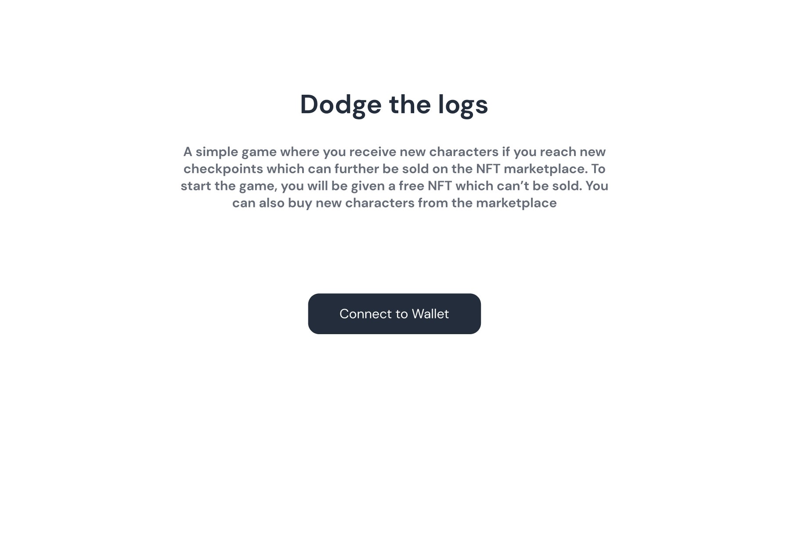

# Dodging Turtis

An NFT game which runs on MATIC network in the Ethereum Blockchain and is powered by Chainlink Oracles.

## Information about the project

The game involves a Turtle character who dodges through the platforms coming towards it with increasing speed. The NFT here is the Turtle character.

A new NFT is given to the user as a reward everytime a new checkpoint score is reached by the user. Higher the score achieved for a new checkpoint, higher the speed of the NFT character that the user receives as a reward. More speed allows the player to move faster through the platforms and reach high score easily. Users would like to own NFTs with higher speed and hence it acts a selling point.

The NFTs are dynamic. Every new Turtle NFT has a unique name, randomized image and a random speed which is ranged according to the score achieved by the user. ERC721 standard is used for implementing the NFT.

ChainlinkClient contract is used to create a Request for calling the API to get metadata for the NFT such as name, image and speed. The Chainlink oracle used for making GET request from the API is [Linkriver](https://linkriver.io/)

The metadata for the NFT is stored in IPFS using the Custom API and it returns the IPFS Hash to the smart contract using Chainlink Oracles.

The DApp also acts as an NFT store. The users can buy and sell NFTs inside the DApp.

## Turtis contract

<a href="https://mumbai.polygonscan.com/address/0x39c328b3ff8296CBdBf1917204103f71D7436226">Click here</a> to view the Turtis contract on Polygonscan

The contract <a href="https://mumbai.polygonscan.com/address/0x39c328b3ff8296CBdBf1917204103f71D7436226#code">code</a> has been verified and it is visible on `mumbai.polygonscan.com`

## TurtisGameUserAuth contract

<a href="https://mumbai.polygonscan.com/address/0x87D83BBE86A224d5B27e330a9d5D1D62EC710512">Click here</a> to view the TurtisGameUserAuth contract on Polygonscan

The contract <a href="https://mumbai.polygonscan.com/address/0x87D83BBE86A224d5B27e330a9d5D1D62EC710512#code">code</a> has been verified and it is visible on `mumbai.polygonscan.com`

## The DApp User Interface



## Built With

- [Ethereum](https://www.ethereum.org/) - Ethereum is a decentralized platform that runs smart contracts
- [Chainlink](https://chain.link/) - Chainlink's decentralized oracle network provides reliable, tamper-proof data for complex smart contracts
- [Polygon](https://polygon.technology/) - Polygon is a protocol and a framework for building and connecting Ethereum-compatible blockchain networks and provides scalable solutions
- [Solidity](https://docs.soliditylang.org/en/v0.8.6/) - The most popular language for writing smart contracts
- [Phaser](https://phaser.io/) - An open source framework for building browser based games
- [ReactJS](https://reactjs.org/) - A JavaScript library for building user interfaces
- [IPFS](https://ipfs.io/) - P2P network for storing and sharing files in a distributed file system
- [Truffle Framework](http://truffleframework.com/) - Truffle is the most popular development framework for Ethereum with a mission to make your life a whole lot easier
- [Alchemy](https://docs.alchemy.com/alchemy/documentation/apis/polygon-api) - To access a node which connects with Ethereum Blockchain on the Polygon Mumbai Testnet
- [Remix - Solidity IDE](https://remix.ethereum.org/) - To compile, test and deploy faster using Javascript VM
- [Visual Studio Code](https://code.visualstudio.com/) - Code Editor
- [Ganache - One Click Blockchain](https://truffleframework.com/ganache) - Local blockchain for testing
- [Open Zeppelin ](https://openzeppelin.org/) - Open source Library of pre-built contracts
- [Metamask](https://metamask.io/) - Wallet Provider
- [Polygonscan](https://mumbai.polygonscan.com/) - View and keep track of transactions happening around a smart contract as well as view its code, read and write stuff to it

## Getting Started

These instructions will get you a copy of the project up and running on your local machine for development and testing purposes.

### Prerequisites

Please make sure you've already installed NPM & Yarn packages, Truffle and enabled MetaMask extension in your browser.

If you don't have `yarn` installed, run the following command:

```
npm install -g yarn
```

If you don't have Truffle installed, run the following command:

```
npm install -g truffle
```

Please make sure that the Metamask wallet is connected to the MATIC Mumbai TestNet and has some MATIC tokens.

### Installing

A step by step guide to locally run the DApp

- First, get free API keys from [Alchemy](https://docs.alchemy.com/alchemy/documentation/apis/polygon-api) and [Polygonscan](https://polygonscan.com/)
- Clone this repository:

```
git clone https://github.com/Hardikag17/NFT-Game
```

- Install all the required packages using the following command

```
yarn
```

- Create a `.env` file and store the following contents in it and include API keys:

```
POLYGONSCAN_API_KEY="<Polygon API Key>"
MNEMONIC="<Enter your metamask seed phrase here>"
POLYGON_MUMBAI_RPC_URL="https://polygon-mumbai.g.alchemy.com/v2/<Alchemy API Key>"
```

- To launch the DApp, use the following command:

```
yarn start
```

## Libraries/services used

- **@truffle/hdwallet-provider** - Used to create a provider using Seed phrase(Mnemonic) and Alchemy RPC URL to connect to the Blockchain
- **web3** - To interact with the deployed smart contract on Polygon Mumbai Testnet
- **@chainlink/contracts** - To inherit ChainlinkClient contract to call an API using the decentralized Chainlink Oracles
- **@openzeppelin/contracts** - To inherit the ERC721 based contracts
- **phaser** - To build the game
- **react** - For creating the fronted DApp
- **@ion-phaser/react** - React specific wrapper for ion-phaser component
- **truffle-plugin-verify** - To verify the smart contract code on Polygonscan using its API
- **dotenv** - For managing data in .env files
- **solc** - For compiling solidity contracts
- **ganache-cli** - For running a local blockchain mostly used for testing purposes
- **mocha & chai** - To test the smart contracts written in solidity
- **solhint** - To lint solidity files
- **prettier & prettier-plugin-solidity** - To format the code

### Some versions of Frameworks and Libraries used in this project are

- **Truffle version** - 5.3.14
- **Solidity version** - 0.6.6
- **Node JS version** - 14.16.1
- **@truffle/hdwallet-provider version** - 1.4.1
- **web3 version** - 1.4.0

## Developers

- **Dinesh B S** [(@DineshBS44)](https://github.com/DineshBS44)
- **Hardik Agarwal** [(@Hardikag17)](https://github.com/Hardikag17)
- **Hritika M Kucheriya** [(@hritikamk)](https://github.com/hritikamk)
- **Suryashankar Das** [(@iamsdas)](https://github.com/iamsdas)

## License

Licensed under MIT License : https://opensource.org/licenses/MIT

<br>
<br>
